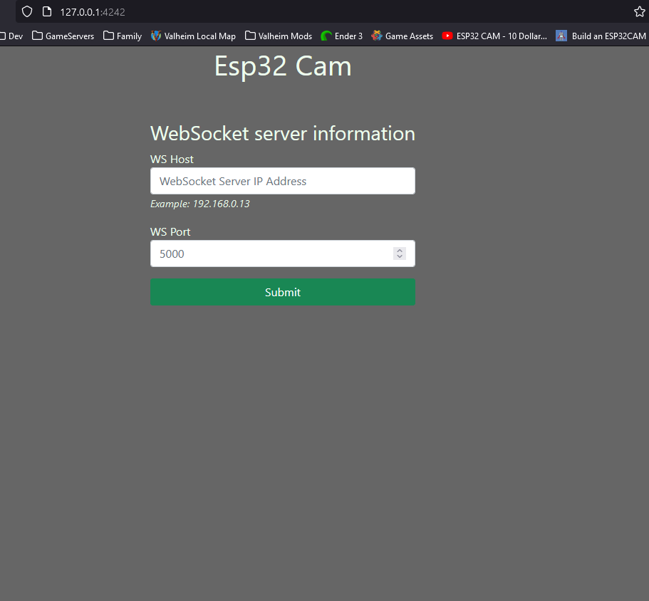
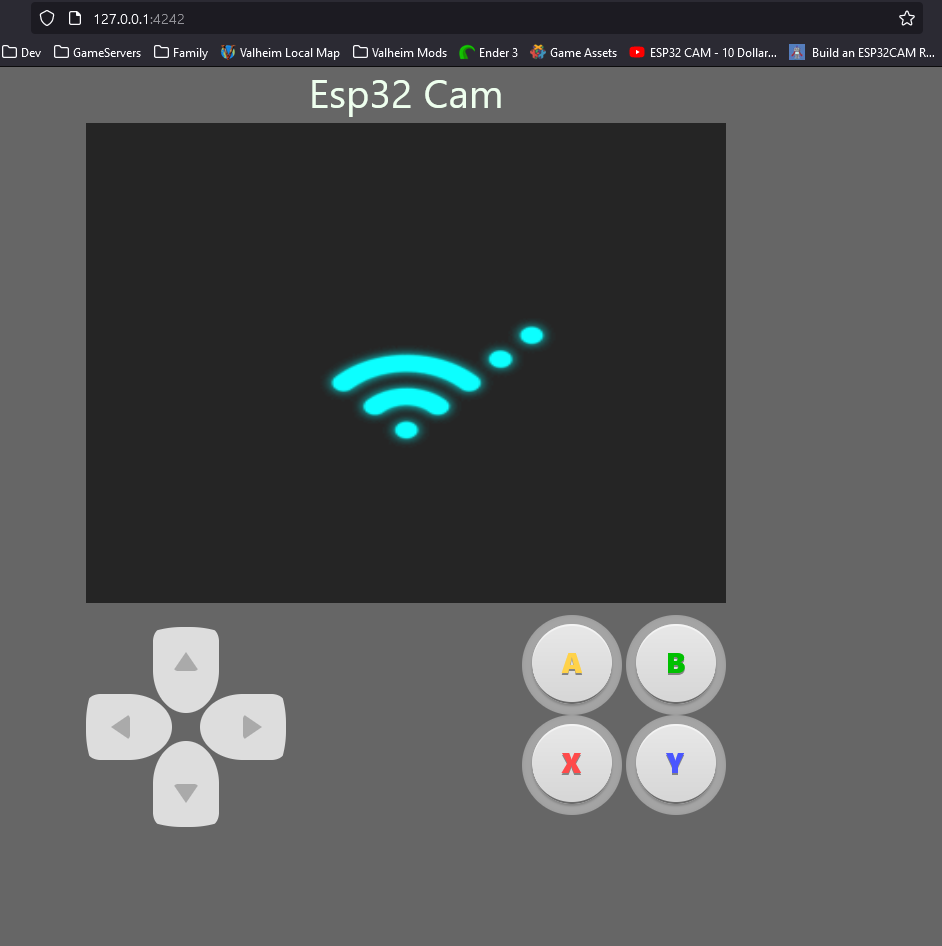
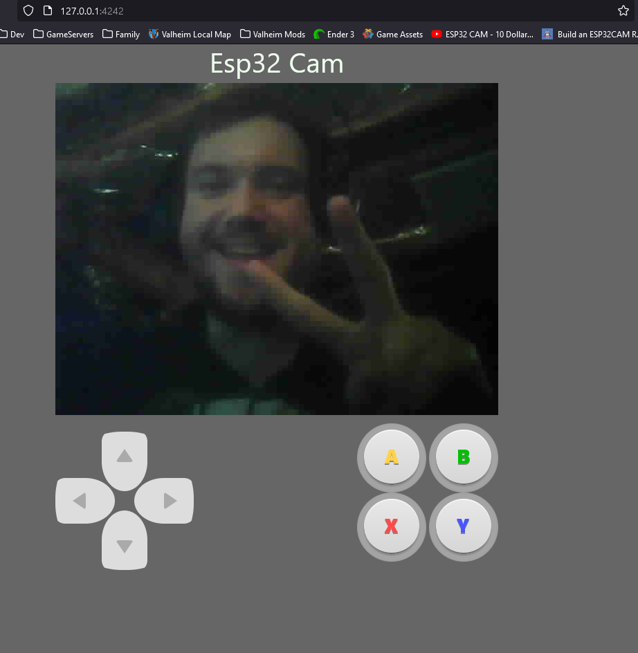

# Esp32Campy
Python implementation for a WebSocket server handling ESP32 Cam module streams. Flask server to handle front-end and house the JS used that does most of the WebSocket work. Since this is using a server to handle everything, the limit for concurrent connections, all receiving the live stream and control access, is high.

This is a fun hobby project and not meant for use in production environments.

- **WebSocket Server**: Handles the websocket connections. Tracks currently connected clients and removes them when their connections drop. When the WS server receives  messages/data it will echo/resend it to all other connected clients.
- **Flask**: Simple flask server handling front-end connections. Serves a single html page containing an img tag for the video data and buttons to control the ESP32 Cam module.

## Software Requirements
- websockets: https://github.com/aaugustin/websockets
- Flask: https://flask.palletsprojects.com/

## Firmware Requirements
- ArduinoJson: https://arduinojson.org/
- Arduino Websockets: https://github.com/gilmaimon/ArduinoWebsockets
- ESP32 Libs & Board manager: https://randomnerdtutorials.com/installing-the-esp32-board-in-arduino-ide-windows-instructions/

## BOM
- ESP32 Cam: https://www.amazon.com/dp/B07S5PVZKV
- USB to FTDI: https://www.sparkfun.com/products/9716

## Run
- `$ git clone git@github.com:techb/Esp32Campy.git`
- Ensure you have the required libraries installed for your Arduino IDE
- Upload the `firmware/` code to the ESP32 Cam module via FTDI
  - You will probably need to make a new Arduino project and save or copy the files
- `$ python -m venv venv`
- `$ venv\Scripts\activate`
  - activating env is dependent on [your OS](https://www.infoworld.com/article/3239675/virtualenv-and-venv-python-virtual-environments-explained.html)
- `$(venv) pip install -r requirements.txt`
- `$(venv) python servers.py`
- Visit your server's IP, or localhost if on the same machine
  - default front-end port: `4242`
  - http://127.0.0.1:4242

## To Do
- Set message events to trigger pin actions on the ESP32
  - Confirmed working and can parse JSON on ESP32
  - Just need to write methods for all of buttons
- Design/Print SMARS bot to house
- Wire diagram and schematics
- Build/Project blog write up

## References
- websockets: https://github.com/aaugustin/websockets
  - docs: https://websockets.readthedocs.io/en/stable/
- great vid, he has more too: https://www.youtube.com/watch?v=SfQd1FdcTlI
- arduino ws broadcast example: https://shorturl.at/akAFG
- loading gif: https://boingboing.net/2015/10/18/loadingicon-trippy-looping-gi.html
- d-pad buttons: https://saruwakakun.com/en/css3-buttons
- AB/XY buttons: https://codepen.io/tswone/pen/GLzZLd
- Bootstrap CSS: https://getbootstrap.com/
- Gamepad support: https://w3c.github.io/gamepad/#remapping
- Gamepad tutorial: https://beej.us/blog/data/javascript-gamepad/