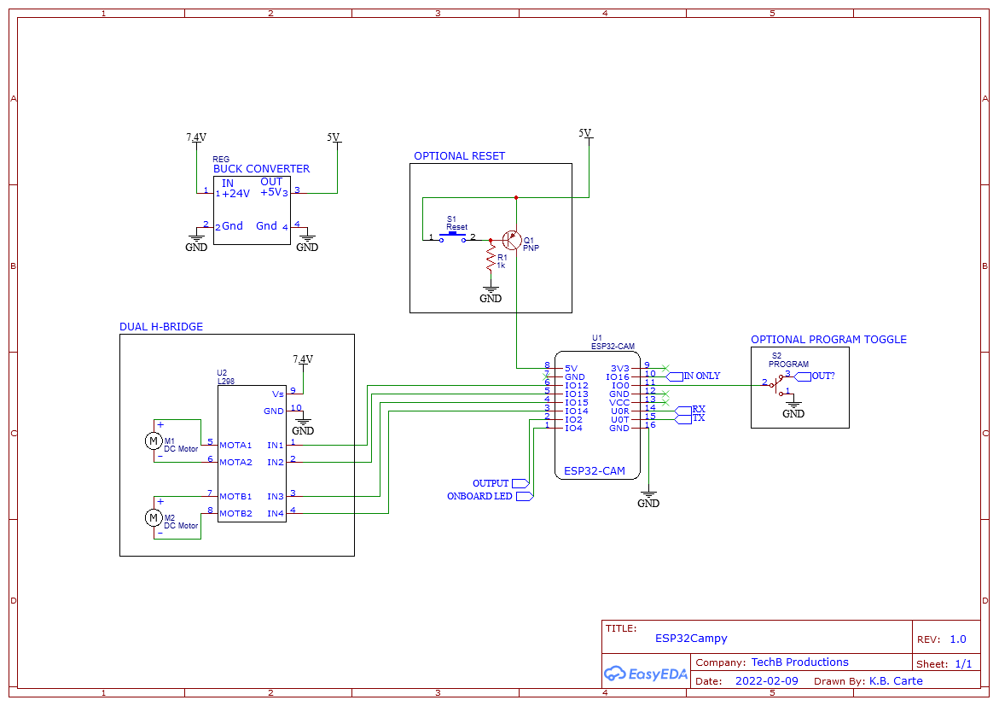

# Esp32Campy
Python implementation for a WebSocket server handling ESP32 Cam module streams. Flask server to handle front-end and house the JS used that does most of the WebSocket work you see. Since this is using a server to handle everything, the limit for concurrent connections, all receiving the live stream and control access, is high.

**This is a fun hobby project and not meant for use in production environments.**

| ABV | == | Abbreviation |
|-----|---|----------------|
| ESP | == | ESP Cam Module |
| WS  | == | Web Socket     |
| FS  | == | Flask Server   |

- **WS Server**: Handles the websocket connections. Tracks currently connected clients and removes them when their connections drop. When the WS server receives  messages/data it will echo/resend it to all other connected clients. I wrote it where you need to put in the WS address:port incase you have multiple devices running at once or multi-client connectons. You can connect to the WS of each bot/device/ESP on the network if you know the IP:PORT address.

- **Flask**: Simple flask server handling front-end connections. Serves a single html page containing an img tag for the video data and buttons to control the ESP. This is split up into 3 (three) main places: `static`, `templates`, `classes/FlaskServer.py`. Each containing the respective code. This is the same IP address as the WS server, but a different port.
  - `static`: JavaScript and CSS
  - `templates`: Flask HTML templates
  - `classes/FlaskServer.py`: Flask Server Class

## Software Requirements
- websockets: https://github.com/aaugustin/websockets
- Flask: https://flask.palletsprojects.com/

## Firmware Requirements
- ArduinoJson: https://arduinojson.org/
- Arduino Websockets: https://github.com/gilmaimon/ArduinoWebsockets
- ESP32 Libs & Board manager: https://randomnerdtutorials.com/installing-the-esp32-board-in-arduino-ide-windows-instructions/

## BOM
- ESP32 Cam: https://www.amazon.com/dp/B07S5PVZKV
- USB to FTDI: https://www.sparkfun.com/products/9716
  - You'll need drivers: https://ftdichip.com/drivers/vcp-drivers/
- N20 Motors X2: https://www.amazon.com/gp/product/B07SQ4TV2T
- H-Bridge: https://www.amazon.com/Aideepen-Driver-H-Bridge-Replace-Stepper/dp/B075S368Y2/
- 18640 Batteries X2: https://www.amazon.com/LCLEBM-3400mAh-Battery-Spotlight-Flashlight/dp/B08H1NZLY7

## 3D Print
**--- WARNING! ---**

The .gcode file provided uses a BLTouch.
If you don't use a BLTouch you will need to remove `G29 ; Level bed` in the .gcode file.
There is also OctoLapse comments, those can be ignored if not using OctoLapse, or removed if you prefer your own config.

**----------------**

#### Remixed From
- cam case: https://www.thingiverse.com/thing:4107609
- 18640 battery holder: https://www.thingiverse.com/thing:2339441
- SMARS robot: https://www.thingiverse.com/thing:2662828

## Schematics
EasyEDA somehow did not save my project... This is the only thing I have from it currently. It is simple enough though. H-Bridge for the motors, voltage regulation, and some optional stuff to make programming easier but not needed (set up for the next project teehee). 

Tripple check connections and cross reference always, I am but a simple man and mess up a lot lol. **Pay attention to orientation and GPIO**

## Run
- `$ git clone git@github.com:techb/Esp32Campy.git`
- Ensure you have the required libraries installed for your Arduino IDE
- Upload the `firmware/` code to the ESP32 Cam module via FTDI
  - Change the wifi credentials to be the same network the servers are running on. 
  - You will probably need to make a new Arduino project and save and/or copy the files.
- `$ python -m venv venv`
- `$ venv\Scripts\activate` :: Windows 11/10
  - activating env is dependent on [your OS](https://www.infoworld.com/article/3239675/virtualenv-and-venv-python-virtual-environments-explained.html)
- `$(venv) pip install -r requirements.txt`
- `$(venv) python servers.py`
- Visit your server's IP, if on _this machine/local_ you can use the loopback address
  - default front-end port: `4242`
  - http://127.0.0.1:4242
  - to change default port: edit (WSPORT, FSPORT) in `servers.py` respectively.

## To Do
- Build/Project blog write up
- Clean 3D print files
- Fix mobile
- Hide/Show connecting on disconnect/reconnect of ESP
- Add hosts file for blah.local addresses
- V2 use UART & arduino controlling the low level bot controls like movement. Stay REST-ish, realtime req->parse->bot control

## References
- websockets: https://github.com/aaugustin/websockets
  - docs: https://websockets.readthedocs.io/en/stable/
- great vid, he has more too: https://www.youtube.com/watch?v=SfQd1FdcTlI
- arduino ws broadcast example: https://shorturl.at/akAFG
- loading gif: https://boingboing.net/2015/10/18/loadingicon-trippy-looping-gi.html
- d-pad buttons: https://saruwakakun.com/en/css3-buttons
- AB/XY buttons: https://codepen.io/tswone/pen/GLzZLd
- Bootstrap CSS: https://getbootstrap.com/
- Gamepad support: https://w3c.github.io/gamepad/#remapping
- Gamepad tutorial: https://beej.us/blog/data/javascript-gamepad/
- RX GPIO 3 is always and only an input: https://electronics.stackexchange.com/a/445636